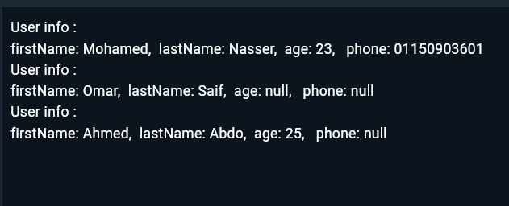

# User Builder Pattern Implementation in Dart

## Overview
This project demonstrates the implementation of the Builder design pattern for a User class in Dart. The Builder pattern is used to construct complex objects step by step, allowing the creation of different representations of an object using the same construction process.

## Features
- Create User objects with required and optional parameters
- Fluent interface for setting optional parameters
- Immutable User objects
- Type-safe builder implementation
- Clean and readable object creation syntax

## Implementation Details

### Classes

#### User
The main class that represents a user with the following attributes:
- `firstName` (required)
- `lastName` (required)
- `age` (optional)
- `phone` (optional)

#### UserBuilder
A builder class that facilitates the creation of User objects with:
- Required fields in constructor
- Fluent methods for optional fields
- Build method to create the final User instance

## Usage Examples

### Creating a User with All Fields

User user = UserBuilder('Mohamed', 'Nasser')
    .age(23)
    .phone('01150903601')
    .build();

### Screenshots

