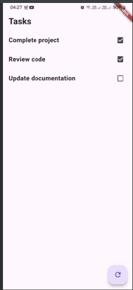

# Clean Architecture Task App

## Overview
A Flutter application implementing Clean Architecture principles with BLoC pattern (Cubit) for state management. This project demonstrates the separation of concerns, dependency injection, and proper architectural layering.

## Project Structure

lib/
├── data/
│ ├── datasources/
│ │ └── task_data_source.dart # Data source implementation
│ ├── repositories/
│ │ └── task_repository_impl.dart # Repository implementation
│ └── models/
│ └── task_model.dart # Data models
├── domain/
│ ├── entities/
│ │ └── task_entity.dart # Business entities
│ ├── repositories/
│ │ └── task_repository.dart # Repository interfaces
│ └── usecases/
│ └── get_tasks_usecase.dart # Use cases
├── presentation/
│ ├── cubit/
│ │ └── task_cubit.dart # State management
│ ├── pages/
│ │ └── task_page.dart # UI pages
│ └── widgets/
│ └── task_list.dart # Reusable widgets
└── dependency_injection_container.dart # Dependency injection setup


## Architecture Layers

### Domain Layer
Contains the business logic of the application:
- Entities
- Repository interfaces
- Use cases

### Data Layer
Implements the data handling logic:
- Data models
- Repository implementations
- Data sources

### Presentation Layer
Handles the UI and state management:
- Cubits for state management
- Pages for UI
- Reusable widgets

## Dependencies

```yaml
dependencies:
  flutter:
    sdk: flutter
  flutter_bloc: ^8.1.3
  get_it: ^7.6.4
```

## Features
- Task list display
- Task completion status
- Refresh functionality
- Error handling
- Loading states

## Usage
# Dependency Injection
- Initialize the dependency injection container:
    
```dart
void main() {
  di.init();
  runApp(const MyApp());
}

```
# Using the Cubit
- Fetch tasks from the repository:

```dart
context.read<TaskCubit>().fetchTasks();

// Listen to state changes
BlocBuilder<TaskCubit, TaskState>(
  builder: (context, state) {
    // Handle different states
  },
)
``` 

## Clean Architecture Benefits
# Separation of Concerns
- Clear separation between business logic and UI
- Independent data layer
- Isolated presentation layer

# Testability
- Easy to test each layer independently
- Mockable dependencies
- Clear boundaries between components

# Maintainability
- Easy to modify individual components
- Clear dependency flow
- Organized code structure

# Scalability
- Easy to add new features
- Clear pattern for extensions
- Modular architecture

## Error Handling
# The app handles various error states:
- Network errors
- Data parsing errors
- Business logic errors
- 
## State Management
# Using Cubit with the following states:
- TaskInitial
- TaskLoading
- TaskLoaded
- TaskError

## Screenshots
