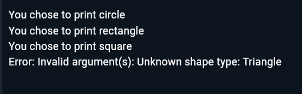

# Shape Factory Pattern Implementation in Dart

## Overview
This project demonstrates the implementation of the Factory design pattern using shapes in Dart. The Factory pattern provides an interface for creating objects but allows subclasses to alter the type of objects that will be created.

## Features
- Abstract Shape class defining common interface
- Multiple concrete shape implementations (Circle, Rectangle, Square)
- Factory class for shape creation
- Error handling for invalid shape types
- Demo class showing usage examples

## Implementation Details

### Core Components

abstract class Shape {
  void revealMe();
}
#### 2. Concrete Shape Classes

class Circle implements Shape {
  @override
  void revealMe() {
    print("You chose to print circle");
  }
}

// Similar implementations for Rectangle and Square
#### 3. Shape Factory

class ShapeFactory {
  Shape getShape(String shapeType) {
    // Creates and returns appropriate shape based on input
  }
}
#### 4. RandomShape Class

class RandomShape {
  final RandomShape factory;
  
  RandomShape(this.factory);
  
  void printShape(String shapeType) {
    // Demonstrates shape creation and usage
  }
}

### Screenshots

