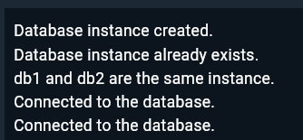

# Shape Factory Pattern Implementation in Dart

# Database Singleton Pattern Implementation

## Overview
A simple implementation of the Singleton design pattern in Dart, demonstrated through a Database class. This pattern ensures that a class has only one instance and provides a global point of access to that instance.

## Implementation Details

### Database Class

class Database {
  static Database? _instance;
  
  Database._();
  
  factory Database.createDatabase() {
    if (_instance == null) {
      _instance = Database._();
      print("Database instance created.");
    } else {
      print("Database instance already exists.");
    }
    return _instance!;
  }
  
  void connect() {
    print("Connected to the database.");
  }
}

### Screenshots

