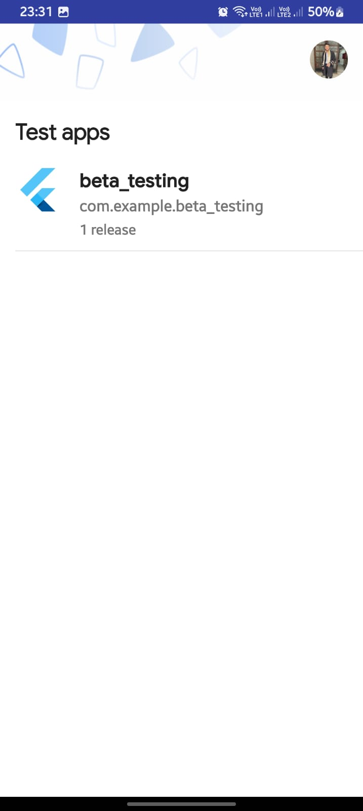

# beta_testing

# Flutter Firebase App Distribution Guide

To distribute a Flutter app using Firebase App Distribution, follow these steps:

---

## **Step 1: Set Up Firebase in Your Flutter Project**

### **1. Create a Firebase Project**
- Go to the [Firebase Console](https://console.firebase.google.com/).
- Click **Add Project** and follow the steps to create a new project.

### **2. Add Your Flutter App to Firebase**
- In the Firebase Console, click **Add App** and select **Android** and/or **iOS**.
- Follow the instructions to register your app (e.g., provide the package name for Android and the bundle ID for iOS).

### **3. Add Firebase Configuration Files**
- **For Android**:
    - Download the `google-services.json` file and place it in the `android/app` directory of your Flutter project.
- **For iOS**:
    - Download the `GoogleService-Info.plist` file and add it to the `ios/Runner` directory in Xcode.
- or you can use the following command to add the configuration files:
    - `dart pub global activate flutterfire_cli`
    - `flutterfire configure --project=beta-testing-fffc5`
    - 
### **4. Add Firebase Dependencies**
- Add the Firebase Core plugin to your `pubspec.yaml` file:
  ```yaml
  dependencies:
    flutter:
      sdk: flutter
    firebase_core: ^3.12.0
- Run `flutter pub get` to install the dependencies.

### **5. Initialize Firebase in Your Flutter App**
- In your main.dart file, initialize Firebase:
```dart
import 'package:firebase_core/firebase_core.dart';
import 'package:flutter/material.dart';

void main() async {
WidgetsFlutterBinding.ensureInitialized();
await Firebase.initializeApp();
runApp(MyApp());
}
```
## **Step 2: Set Up Firebase App Distribution
### **1. Enable Firebase App Distribution
- In the Firebase Console, go to Run > App Distribution.

Follow the prompts to enable App Distribution for your project.

### **2. Add Testers
- In the Firebase Console, go to App Distribution > Testers & Groups.

- Create a group of testers and add their email addresses.

## **Step 3: Build Your Flutter App
### **1. Build the App for Android
- Run the following command to build an APK or AAB:
- `flutter build apk --release` or `flutter build appbundle --release`
- The APK or AAB file will be generated in the `build/app/outputs/flutter-apk` directory.
- Drag and drop the apk file to firebase console
- You can find an invitation link to download the app using 'App Tester' app in the testers' email inbox.
- appId: '1:1045127042203:android:1098431fd195f6c249a23e'
- projectId: 'beta-testing-fffc5',
  

## Screenshots



