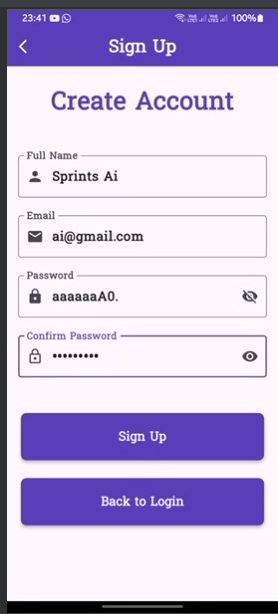
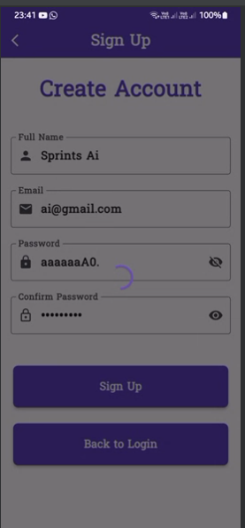
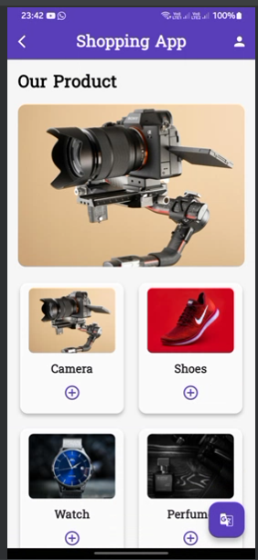
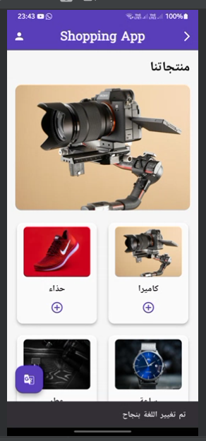
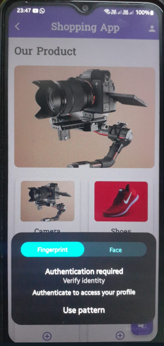
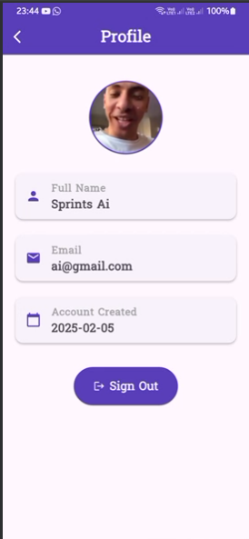

# Shopping App

A responsive Flutter shopping application featuring secure user authentication, product displays, hot offers, multilingual support, and a clean user interface with smooth animations.

## Features

### Localization
- **Multi-Language Support**
    - Easy language switching between English and Arabic
    - Real-time UI updates with translations
    - Persistent language selection
    - RTL (Right-to-Left) support for Arabic
    - Smooth transition between languages

- **Translation Implementation**
    - Uses easy_localization package
    - JSON-based translation files
    - Centralized translation management
    - Context-aware language switching
    - Automatic text direction handling

### Authentication
- **Sign Up System**
    - Secure user registration form
    - Real-time input validation:
        - Capitalized first letter validation for full name
        - Email format validation (@)
        - Password strength validation (minimum 6 characters)
        - Password confirmation matching
    - Success dialog with navigation flow
    - Responsive form layout adapting to different screen sizes

### Local Storage
- **Profile Image Management**
    - Users can pick and save profile images locally.
    - Images are stored in the device's local storage using the path_provider package.
    - Saved images persist across app restarts.
    - Supports both gallery and camera image selection (via image_picker).
    - Efficient error handling for saving and loading images.

### Animations & Transitions
- **Page Transitions**
    - Smooth fade-out animation when leaving sign-up page (3-second duration)
    - Custom fade-in transition when entering shopping home
    - Coordinated multi-step animation flow
    - Easing curves for natural motion

- **Animation Components**
    - AnimationController for precise timing control
    - Custom fade transitions using Tween animations
    - Status listeners for sequential animations
    - Efficient rebuilding with AnimatedBuilder
    - Scale transformations for enhanced visual feedback

- **Animation Technical Details**
    - Implements SingleTickerProviderStateMixin
    - Uses CurvedAnimation with easeOut curve
    - Manages animation state with boolean flags
    - Proper disposal of animation controllers
    - Custom PageRouteBuilder for navigation transitions

### Design & User Experience
- **Responsive Design**
    - Adapts to different screen sizes
    - Consistent layout across devices
    - Optimized for both portrait and landscape modes
    - RTL layout support for Arabic

- **Custom Components**
    - Reusable text form fields with validation
    - Custom styled buttons
    - Success dialogs with animations
    - Responsive app bar with language switcher
    - Animated page transitions
    - Localized text components

### Navigation Flow with Animations
1. Sign Up Page (initial state)
2. Success Dialog (on successful validation)
3. Fade-out animation (3-second transition)
4. Shopping Home Page (fade-in transition)

## Technical Details
- Built with Flutter
- Implements MediaQuery for responsive layouts
- Custom widgets for reusability
- Form validation using GlobalKey<FormState>
- Stateful widget management
- Animation system features:
    - Custom animation controllers
    - Tween animations
    - Curved easing functions
    - Coordinated transitions
    - State management for animations
- **Profile Image Storage**
    - Uses the path_provider package to access the device's local storage.
    - Images are saved in the app's document directory.
    - File paths are dynamically generated using the user's unique ID.
    - Images are loaded automatically when the app starts.
- **Error Handling**
    - Proper error handling for file operations (saving and loading).

    - Fallback to a default icon if no image is found.

- **Dependencies**

    - image_picker: For selecting images from the gallery or camera.

    - path_provider: For accessing the device's local storage.

### Localization Implementation
- **Configuration**
    - easy_localization package integration
    - Supported languages: English (en) and Arabic (ar)
    - JSON-based translation files
    - Fallback locale handling

- **Translation Structure**
    - Organized JSON translation files
    - Separate keys for different sections
    - Context-aware translations
    - RTL support for Arabic

- **Language Switching**
    - Real-time language toggle
    - Persistent language selection
    - Automatic UI direction adjustment
    - Smooth transition between languages

### Firebase Configuration
- Firebase is integrated into the app to handle user authentication.
- Ensure the following Firebase services are enabled in your project:
    - **Authentication**: Email/Password provider enabled.

### Screenshots

### Permissions
- **Android**
  - <uses-permission android:name="android.permission.USE_BIOMETRIC"/>
  - <uses-permission android:name="android.permission.READ_EXTERNAL_STORAGE"/>
  - <uses-permission android:name="android.permission.WRITE_EXTERNAL_STORAGE"/>
- **iOS**
  - <key>NSPhotoLibraryUsageDescription</key>
  - <string>We need access to your photo library to upload images.</string>
  - <key>NSCameraUsageDescription</key>
  - <string>We need access to your camera to take photos.</string>
  - <key>NSMicrophoneUsageDescription</key>
  - <string>We need access to your microphone to record videos.</string>

### Dependencies
- firebase_auth: For user authentication

- image_picker: For selecting profile images

- path_provider: For local storage

- easy_localization: For multi-language support

- flutter_localizations: For RTL support