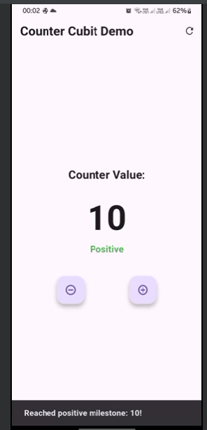
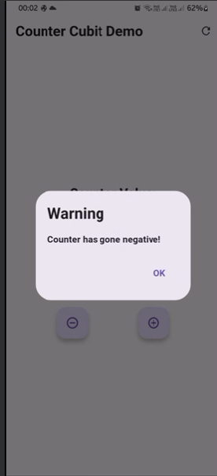
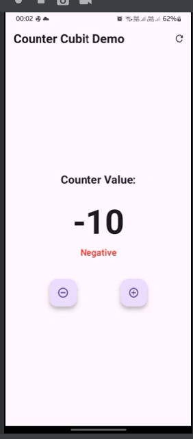

# Counter App with Cubit

A Flutter application demonstrating state management using Cubit pattern, featuring a counter with milestone notifications and theme management.

## 🎯 Features

- Counter increment/decrement functionality
- Milestone notifications at ±10
- Warning dialog for first negative value
- Reset functionality
- Positive/Negative value indicators
- Clean architecture with Cubit pattern

## 🏗️ Project Structure

lib/
├── cubit/
│   ├── counter_cubit.dart
│   └── counter_state.dart
├── home.dart
└── main.dart
## 📱 Screenshots:

## 🛠️ Technical Implementation

### State Management

/// Base state class
sealed class CounterState {
  final int count;
  final String message;
  
  const CounterState({
    required this.count,
    this.message = '',
  });
}

/// Initial and Value states
final class CounterInitial extends CounterState {
  const CounterInitial() : super(count: 0);
}

final class CounterValue extends CounterState {
  const CounterValue({required super.count, super.message});
}

### Cubit Implementation
class CounterCubit extends Cubit<CounterState> {
  CounterCubit() : super(const CounterInitial());

  void increment() {...}
  void decrement() {...}
  void reset() {...}
}

### 💡 Usage Examples
Increment Counter
DART

context.read<CounterCubit>().increment();
Decrement Counter
DART

context.read<CounterCubit>().decrement();
Reset Counter
DART

context.read<CounterCubit>().reset();
🎨 Features Demonstration
Counter Operations

Use + button to increment
Use - button to decrement
Use refresh button to reset
Notifications

Dialog on first negative value
SnackBar at ±10 milestones
Color-coded value indicators
UI Components

BlocListener for notifications
BlocBuilder for UI updates
BlocConsumer for combined functionality
### 🔍 Key Features Explained
BlocListener Implementation
DART

BlocListener<CounterCubit, CounterState>(
  listenWhen: (previous, current) => 
      previous.count >= 0 && current.count < 0,
  listener: (context, state) {
    // Show dialog for first negative value
  },
)
BlocConsumer Implementation
DART

BlocConsumer<CounterCubit, CounterState>(
  listenWhen: (previous, current) => 
      current.message.isNotEmpty,
  listener: (context, state) {
    // Show milestone messages
  },
  builder: (context, state) {
    // Build UI
  },
)