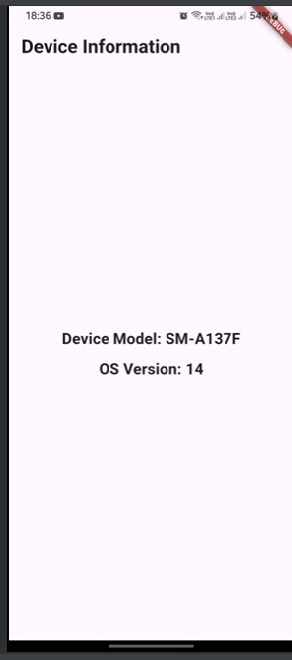

# Device Information Flutter App

## Overview
This Flutter application provides a simple way to retrieve and display device information, including the device model and operating system version.

## Features
- Retrieve device model name
- Get operating system version
- Support for both Android and iOS platforms
- Simple, clean user interface

## Screenshots

## Prerequisites
- Flutter SDK
- Android Studio or VS Code with Flutter extensions
- Android/iOS device or emulator

## Dependencies
- Flutter
- device_info_plus 11.2.2

## Configuration
1. Add the `device_info_plus` package to your `pubspec.yaml` file.
2. Run `flutter pub get` to install the package.

## Permissions
# Android:
- Optional permissions in AndroidManifest.xml:

# <uses-permission android:name="android.permission.READ_PHONE_STATE"/>

# IOS:
- Optional permissions in Info.plist:
# <key>UIDeviceFamily</key>
# <array>
#  <integer>1</integer>
#  <integer>2</integer>
#  </array>

## Code Structure
- lib/
- │
- ├── main.dart          # App entry point
- └── device_info.dart  # Device information page
