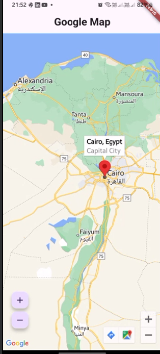

# Google Maps Flutter Example

## Overview

This Flutter application demonstrates how to integrate Google Maps into a mobile app. It displays a map centered on Cairo, Egypt, with interactive features such as zooming in and out, and markers that provide information about locations.

## Features

- **Google Maps Integration**: Displays a Google Map with initial camera position set to Cairo.
- **Marker**: Adds a marker to indicate Cairo with information.
- **Zoom Controls**: Floating action buttons to zoom in and out on the map.
- **Interactive Map**: Allows users to interact with the map using gestures.

## Getting Started

To run this application, ensure you have Flutter installed on your machine. Follow the steps below to set up the project:

### Prerequisites

- Flutter SDK
- An IDE (e.g., Android Studio, Visual Studio Code)
- An emulator or a physical device for testing
- Google Maps API key

### Installation

## Install dependencies:  
flutter pub get google_maps_flutter: ^2.10.0

## Set up Google Maps API Key:  
- Open the android/app/src/main/AndroidManifest.xml file.
- Replace the value of android:value in the <meta-data> tag with your Google Maps API key:
- <meta-data android:name="com.google.android.geo.API_KEY"android:value="YOUR_API_KEY_HERE"/>

## Screenshots

## Usage
Once the application is running, you will see a Google Map centered on Cairo, Egypt. You can interact with the map using gestures to pan, rotate, and zoom. Use the floating action buttons to zoom in and out.