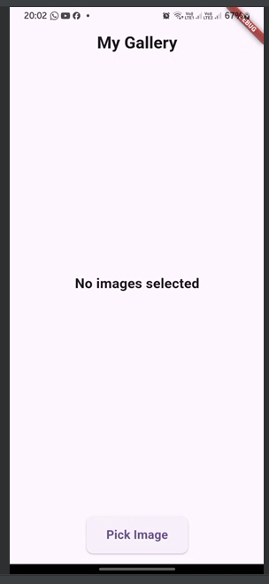
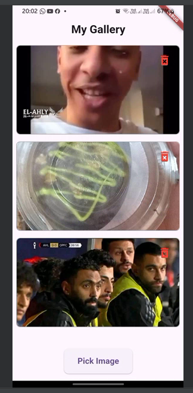

# Flutter Gallery App

## 📱 Overview

The Flutter Gallery App is a mobile application that allows users to easily pick, view, and manage multiple images from their device's gallery. Built with Flutter, this app provides a simple and intuitive interface for image selection and management.

## ✨ Features

- 🖼️ Pick multiple images from device gallery
- 📋 Display images in a scrollable ListView
- 🗑️ Delete individual images
- 🛡️ Comprehensive error handling

## 🚀 Getting Started

### Prerequisites

- Flutter SDK (3.0.0 or higher)
- Android Studio or VS Code
- Git

## 📂 Project Structure
├── lib/
│   ├── main.dart
│   └── gallery_page.dart

## 🛠️ Key Dependencies

- dependencies:
  - flutter:
    - sdk: flutter
  - image_picker: ^1.0.4

## 📱 Platform Configuration
# iOS Configuration
- Add to ios/Runner/Info.plist:

- <key>NSPhotoLibraryUsageDescription</key>
- <string>This app requires access to the photo library to pick images.</string>

# Android Configuration
- Add to android/app/src/main/AndroidManifest.xml:

- <uses-permission android:name="android.permission.READ_EXTERNAL_STORAGE"/>
- <uses-permission android:name="android.permission.WRITE_EXTERNAL_STORAGE"/>

## Screenshots

