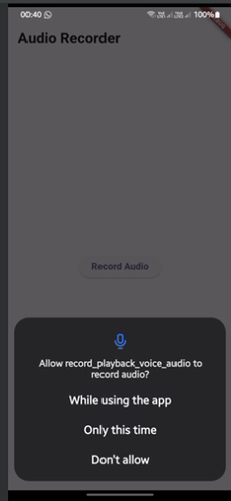
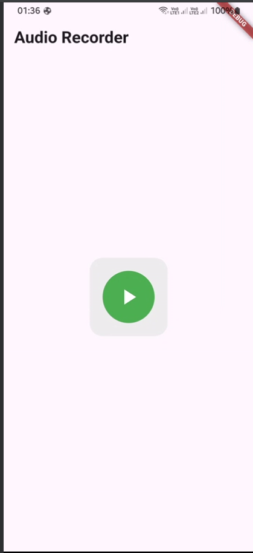
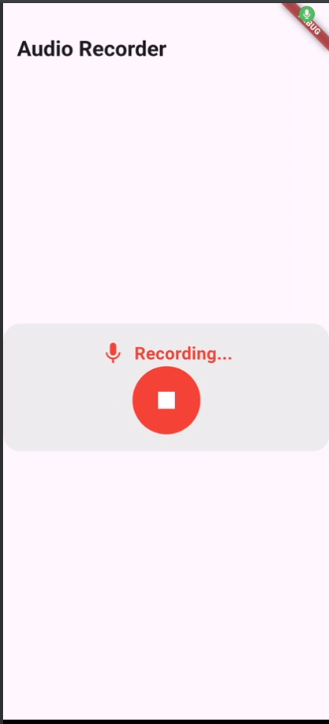
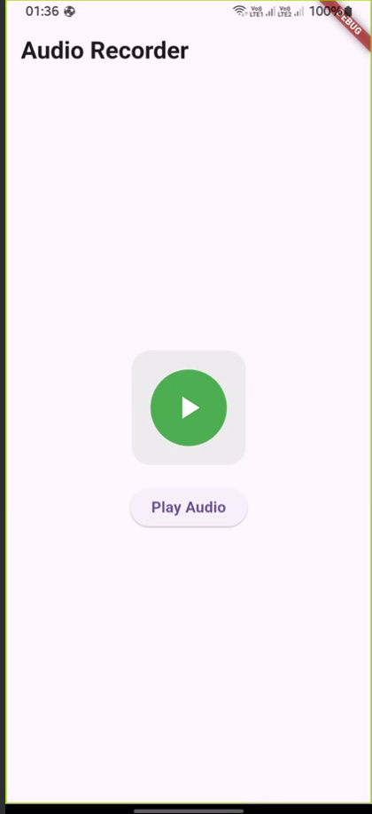

# Audio Recorder Flutter App

A simple Flutter application that allows users to record audio and play it back. The app features a clean UI with recording indicators and playback controls.

## Features

- Audio recording with visual feedback
- Audio playback functionality
- Permission handling
- Error notifications via SnackBar
- Circular recording button with state indication
- Temporary file storage management

## Dependencies

Add these dependencies to your `pubspec.yaml`:

## yaml
- dependencies:
  - flutter_sound: ^9.21.1
  - flutter:
    - sdk: flutter
  - audioplayers: ^4.1.0  # For audio playback
  - record: ^4.4.4        # For audio recording
  - path_provider: ^2.1.0 # For handling file paths
  - permission_handler: ^8.1.4 # For handling permissions
  
## Required Permissions
- **Android**
- Add these permissions to your android/app/src/main/AndroidManifest.xml file inside the <manifest> tag:
  - <uses-permission android:name="android.permission.RECORD_AUDIO"/>
  - <uses-permission android:name="android.permission.WRITE_EXTERNAL_STORAGE"/>
  - <uses-permission android:name="android.permission.READ_EXTERNAL_STORAGE"/>
    
- **iOS**
- Add this permission to your ios/Runner/Info.plist file inside the <dict> tag:
- <key>NSMicrophoneUsageDescription</key>
- <string>This application needs to access your microphone</string>

## Setup

1. Create a new Flutter project
2. Replace the contents of `lib/main.dart` with the provided code
3. Add the required dependencies to `pubspec.yaml`
4. Run `flutter pub get`
5. Add the required permissions to Android and iOS configuration files
6. Run the app using `flutter run`

## Usage

1. Press the circular button to start recording
2. The button will turn red and show a recording indicator while recording
3. Press the button again to stop recording
4. Once recording is complete, a "Play Audio" button will appear
5. Press the "Play Audio" button to play back the recorded audio

## Error Handling

### The app includes error handling for:

- Permission denials
- Recording start/stop failures
- Playback failures

## Screenshots

## ScreenVideo
- you can see the screen video from this path: audio_recorder_screen_record.rar
- 