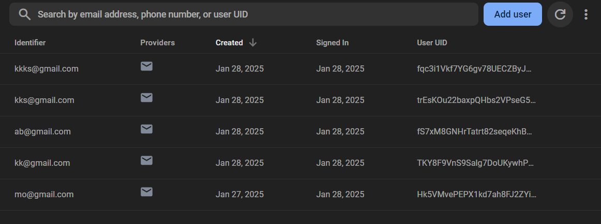
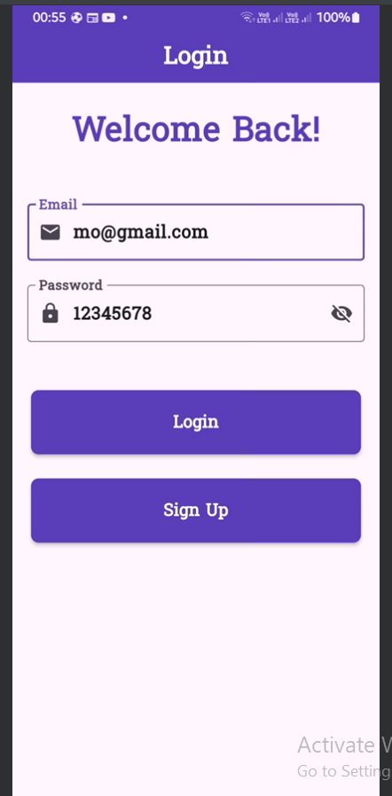
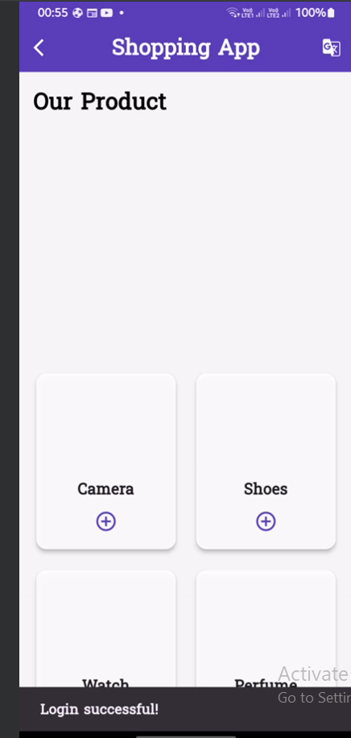
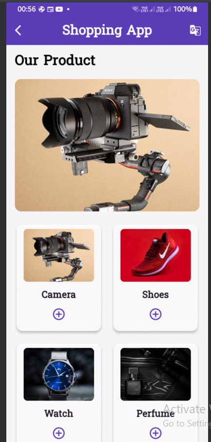
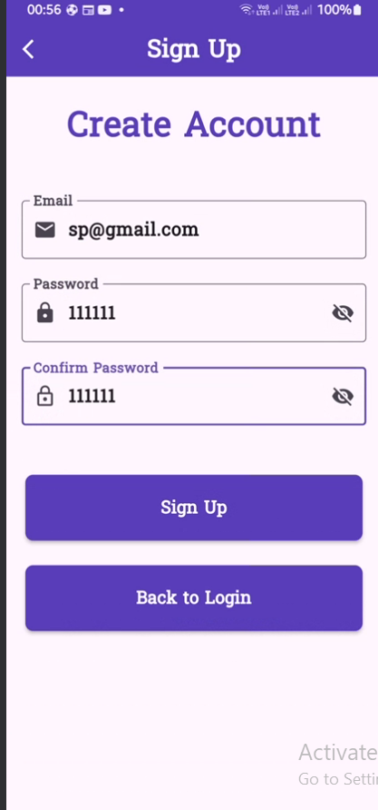
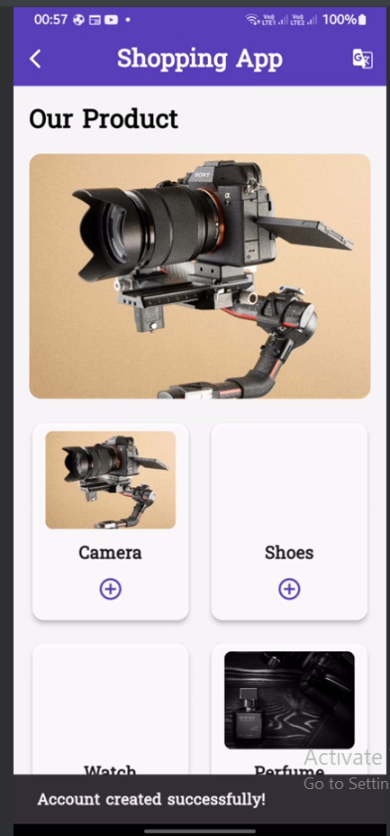

# Shopping App

A responsive Flutter shopping application featuring secure user authentication, product displays, hot offers, multilingual support, and a clean user interface with smooth animations.

## Features

### Localization
- **Multi-Language Support**
  - Easy language switching between English and Arabic
  - Real-time UI updates with translations
  - Persistent language selection
  - RTL (Right-to-Left) support for Arabic
  - Smooth transition between languages

- **Translation Implementation**
  - Uses easy_localization package
  - JSON-based translation files
  - Centralized translation management
  - Context-aware language switching
  - Automatic text direction handling

### Authentication
- **Sign Up System**
  - Secure user registration form
  - Real-time input validation:
    - Capitalized first letter validation for full name
    - Email format validation (@)
    - Password strength validation (minimum 6 characters)
    - Password confirmation matching
  - Success dialog with navigation flow
  - Responsive form layout adapting to different screen sizes

### Animations & Transitions
- **Page Transitions**
  - Smooth fade-out animation when leaving sign-up page (3-second duration)
  - Custom fade-in transition when entering shopping home
  - Coordinated multi-step animation flow
  - Easing curves for natural motion

- **Animation Components**
  - AnimationController for precise timing control
  - Custom fade transitions using Tween animations
  - Status listeners for sequential animations
  - Efficient rebuilding with AnimatedBuilder
  - Scale transformations for enhanced visual feedback

- **Animation Technical Details**
  - Implements SingleTickerProviderStateMixin
  - Uses CurvedAnimation with easeOut curve
  - Manages animation state with boolean flags
  - Proper disposal of animation controllers
  - Custom PageRouteBuilder for navigation transitions

### Design & User Experience
- **Responsive Design**
  - Adapts to different screen sizes
  - Consistent layout across devices
  - Optimized for both portrait and landscape modes
  - RTL layout support for Arabic

- **Custom Components**
  - Reusable text form fields with validation
  - Custom styled buttons
  - Success dialogs with animations
  - Responsive app bar with language switcher
  - Animated page transitions
  - Localized text components

### Navigation Flow with Animations
1. Sign Up Page (initial state)
2. Success Dialog (on successful validation)
3. Fade-out animation (3-second transition)
4. Shopping Home Page (fade-in transition)

## Technical Details
- Built with Flutter
- Implements MediaQuery for responsive layouts
- Custom widgets for reusability
- Form validation using GlobalKey<FormState>
- Stateful widget management
- Animation system features:
  - Custom animation controllers
  - Tween animations
  - Curved easing functions
  - Coordinated transitions
  - State management for animations

### Localization Implementation
- **Configuration**
  - easy_localization package integration
  - Supported languages: English (en) and Arabic (ar)
  - JSON-based translation files
  - Fallback locale handling

- **Translation Structure**
  - Organized JSON translation files
  - Separate keys for different sections
  - Context-aware translations
  - RTL support for Arabic

- **Language Switching**
  - Real-time language toggle
  - Persistent language selection
  - Automatic UI direction adjustment
  - Smooth transition between languages

### Firebase Configuration
- Firebase is integrated into the app to handle user authentication.
- Ensure the following Firebase services are enabled in your project:
  - **Authentication**: Email/Password provider enabled.

### Screenshots

