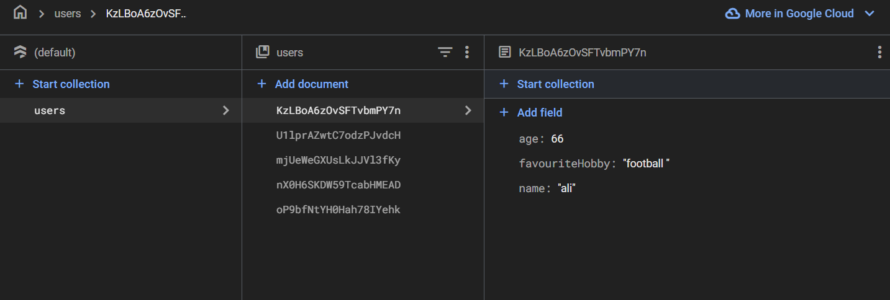
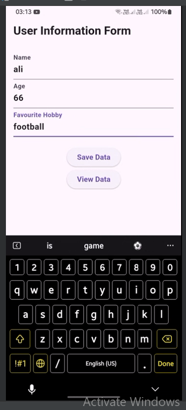
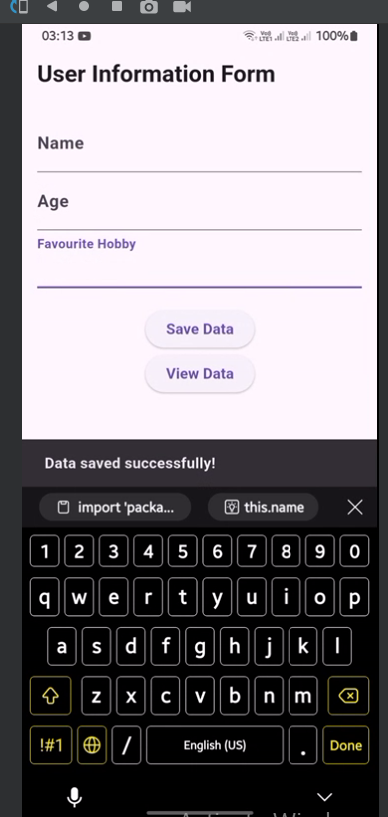
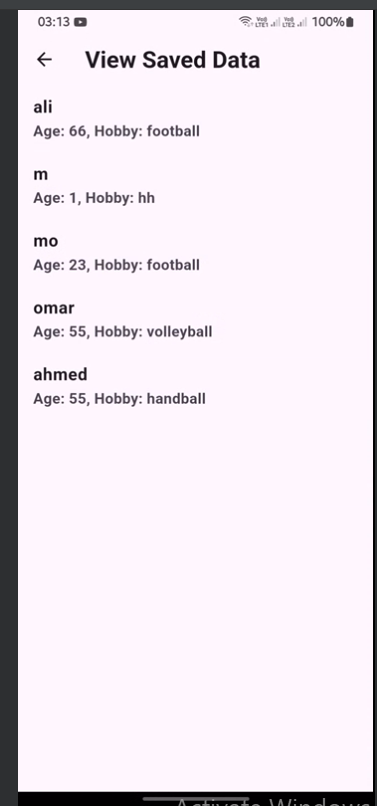

# User Info Firebase App

A Flutter application that allows users to input, save, and view user information (name, age, and favorite hobby) using **Cloud Firestore** for real-time database storage.

---

## Features

### **1. User Information Form**
- A form with input fields for:
    - **Name**
    - **Age**
    - **Favorite Hobby**
- Validates inputs to ensure proper data entry.
- Saves user information to **Cloud Firestore**.

### **2. View Saved Data**
- Displays a real-time list of saved user data.
- Fetches and updates data dynamically using Firestore streams.
- Shows:
    - **User Name**
    - **User Age**
    - **Favorite Hobby**

### **3. Firebase Integration**
- Fully integrated with **Firebase** for:
    - Cloud Firestore database operations.
    - Real-time data synchronization.

---

## Technologies Used

### **Frontend**
- Flutter (Dart)
    - Widgets: `TextFormField`, `ElevatedButton`, `ListView`, `StreamBuilder`, etc.
    - State Management: `setState` and Stateless Widgets.

### **Backend**
- Firebase
    - **Firebase Core**: App initialization.
    - **Cloud Firestore**: Data storage and real-time streaming.

---

## Installation Guide

### **1. Prerequisites**
- Install Flutter: [Flutter Installation Guide](https://docs.flutter.dev/get-started/install)
- Set up Firebase for Flutter: [Add Firebase to Your Flutter App](https://firebase.google.com/docs/flutter/setup)


### **2. Set Up Firebase**
1. Go to the [Firebase Console](https://console.firebase.google.com/).
2. Add a new project or use an existing one.
3. Enable **Cloud Firestore** in the Firebase Console.
4. Download the `google-services.json` file and place it in the `android/app/` directory.
5. Add the following dependencies to `pubspec.yaml`:
   ```yaml
   dependencies:
     firebase_core: ^2.13.0
     cloud_firestore: ^4.7.0
   ```
6. Run:
   ```bash
   flutter pub get
   ```

### **4. Run the App**
```bash
flutter run
```

---

## Project Structure

### **1. Models**
- **`UserFirebaseModel`**
    - Represents user data with fields: `name`, `age`, `favouriteHobby`.
    - Converts data to/from Firestore.

### **2. Services**
- **`FirestoreService`**
    - Saves user data to Firestore.
    - Fetches user data as a real-time stream.

### **3. Pages**
- **`UserInfoForm`**
    - Form to collect user information and save it to Firestore.
- **`ViewDataPage`**
    - Displays saved user data in a list format using Firestore streams.

---

## Code Overview

### **User Information Form**
- Collects user inputs.
- Saves data to Firestore using `FirestoreService`.
- Validation ensures fields are not empty.

### **View Data Page**
- Fetches data from Firestore.
- Dynamically updates using `StreamBuilder`.

### **Firestore Integration**
- Data is stored in a `users` collection in Firestore.
- Provides a real-time streaming interface for data retrieval.

---

## Example Code

### **Save User Data**
```dart
final user = UserFirebaseModel(
  name: _nameController.text,
  age: int.tryParse(_ageController.text),
  favouriteHobby: _hobbyController.text,
);
await _firestoreService.saveUserData(user);
```

### **Retrieve User Data**
```dart
Stream<List<UserFirebaseModel>> getUsers() {
  return _firestore.collection('users').snapshots().map((snapshot) {
    return snapshot.docs.map((doc) {
      return UserFirebaseModel.fromFirestore(doc);
    }).toList();
  });
}
```

---

## Screenshots 





---


